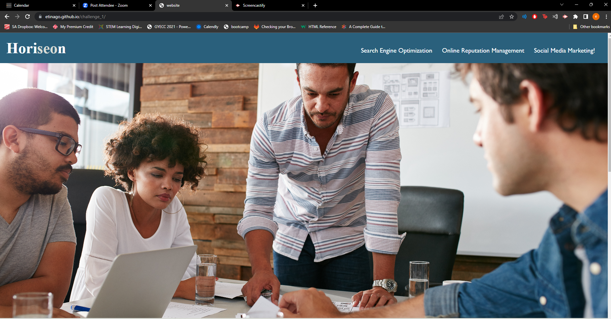
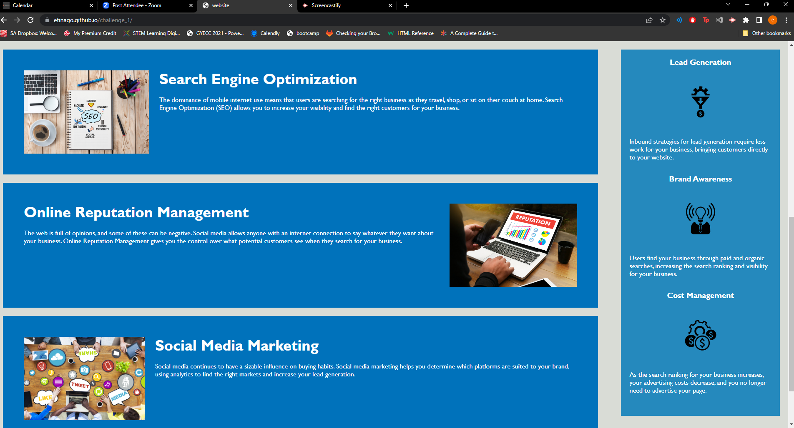
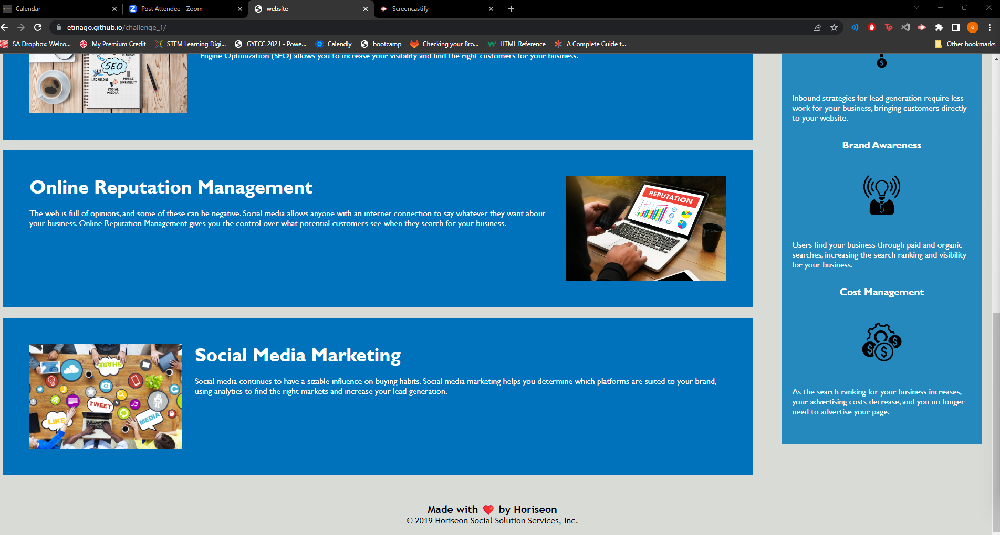

# Human Centred Web Design - Accessibility

## Description
This projects aims to address key element in web design i.e Accessibility to ensure that people with disabilities can access the website using assertive technologies.

Through use the alt attribute for all img tags to provide alternative text that describes the image. This improves accessibility and helps users who can't see the images understand their content.

## Improvements 
Introduced alt tags on all images in html file to improve the site to be more accessible.

## Scrrenshot of site

## Installation
N/A

## Credits
N/A